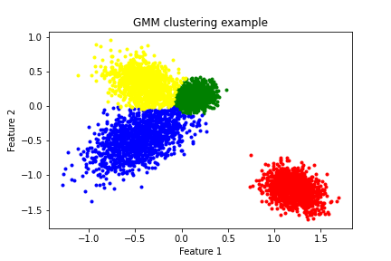

# GMM

GMM (Gaussian Mixture Model) with EM (Expectation-Maximization algorithm) from scratch in python

paper link: http://crowley-coutaz.fr/jlc/Courses/2012/ENSI2.SIRR/EM-tutorial.pdf

## Results

